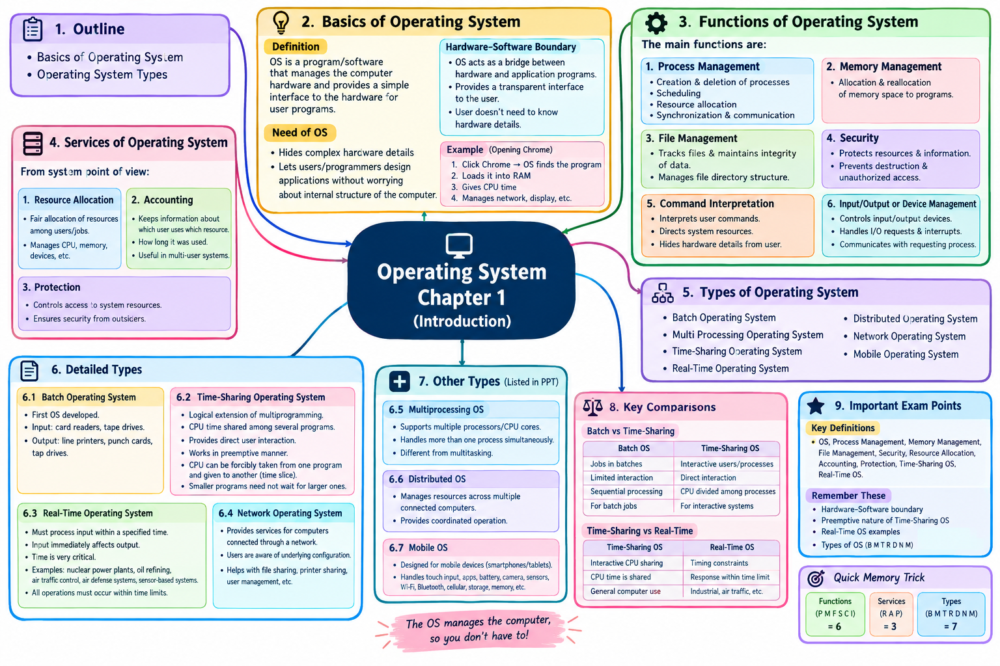

# Operating System — Chapter 1: Introduction

## 1. Basics of Operating System

### What is an Operating System?

An **Operating System (OS)** is system software that acts as a bridge between:

**User → Application Programs → Operating System → Hardware**

Examples of operating systems:

- Windows
    
- Linux
    
- macOS
    
- Android
    
- iOS
    

Your PPT defines an OS as software that **manages computer hardware and provides an interface to hardware for user programs**.

### Why do we need an Operating System?

A computer contains complicated hardware:

- CPU
    
- RAM
    
- Hard disk/SSD
    
- Keyboard
    
- Mouse
    
- Monitor
    
- Printer
    
- Network devices
    

Normally, an application would need to understand how each piece of hardware works.

For example, suppose a program wants to save a file.

Without an OS, the program would have to deal directly with the storage hardware.

With an OS:

**Application → OS → Storage Device**

The application simply asks the OS:

> "Save this file."

The OS handles the hardware details.

This is why the PPT says the OS allows the user/programmer to design applications **without concerning themselves with the internal details of the computer**.

### Simple example

When you open Chrome:

1. You click Chrome.
    
2. The OS finds the Chrome program.
    
3. The OS loads it into RAM.
    
4. The OS gives it CPU time.
    
5. Chrome requests network access.
    
6. The OS manages the network hardware.
    
7. Chrome displays information on the screen.
    

You don't manually control the CPU, RAM, disk controller, or network card.

That's the OS's job.

---

# 2. Functions of Operating System

Your PPT identifies six major functions:

1. Process Management
    
2. Memory Management
    
3. File Management
    
4. Security
    
5. Command Interpretation
    
6. Input/Output or Device Management
    

Let's understand each.

---

# 2.1 Process Management

A **process** is a program that is currently being executed.

For example:

- `chrome.exe` running → process
    
- Music player running → process
    
- Word running → process
    

A program sitting on your disk is not necessarily a process. Once it starts executing, it becomes a process.

### What does Process Management do?

According to your PPT, process management handles:

- Creation of processes
    
- Deletion of processes
    
- Scheduling processes
    
- Resource allocation
    
- Synchronization
    
- Communication between processes
    

### Process creation

Suppose you open Calculator.

The OS creates a process for Calculator and gives it the resources it needs.

### Process scheduling

Suppose several programs want the CPU:

```text
Chrome
Music Player
Calculator
VS Code
```

But the CPU has limited execution capacity.

The OS decides which process gets CPU time and when.

This is called **CPU/process scheduling**.

For example:

```text
CPU
 ↓
Chrome → Music → Calculator → Chrome → VS Code
```

The OS continuously manages this execution.

### Process deletion

When you close a program, its process ends.

The OS releases the resources that were being used by that process.

### Process synchronization

Sometimes multiple processes need to work with the same resource.

For example:

```text
Process A ──┐
            ├── Shared File
Process B ──┘
```

The OS needs mechanisms to prevent conflicts.

### Process communication

Processes sometimes need to exchange information.

For example:

```text
Process A → Message/Data → Process B
```

The OS provides mechanisms for this communication.

---

# 2.2 Memory Management

Memory management deals primarily with **main memory (RAM)**.

Your PPT describes this as allocating and reallocating memory space to programs that need it.

Imagine RAM has:

```text
+----------------------+
| Operating System     |
+----------------------+
| Chrome               |
+----------------------+
| VS Code              |
+----------------------+
| Music Player         |
+----------------------+
| Free Memory          |
+----------------------+
```

When you open another program, the OS must determine:

> Where should this program be placed in RAM?

### Allocation

Giving memory to a program:

```text
Program A → 200 MB
Program B → 500 MB
Program C → 100 MB
```

### Reallocation

When a program closes:

```text
Program B closes
       ↓
500 MB becomes available
```

The OS can make that memory available to another program.

### Why is memory management important?

Because multiple programs may run simultaneously.

The OS needs to:

- Track memory usage
    
- Allocate memory
    
- Free memory
    
- Prevent inappropriate access between processes
    
- Manage available memory efficiently
    

---

# 2.3 File Management

Computers store huge amounts of information as files.

Examples:

```text
photo.jpg
movie.mp4
notes.txt
program.exe
database.db
```

Your PPT says file management involves keeping track of files and maintaining the integrity of data, including the **file directory structure**.

### What does the OS manage?

For example:

```text
Documents
 ├── College
 │    ├── OS.pdf
 │    └── DBMS.pdf
 │
 └── Projects
      └── project.docx
```

The OS manages:

- File creation
    
- File deletion
    
- File naming
    
- Directories/folders
    
- File organization
    
- Storage locations
    
- Access to files
    

### Example

When you click:

**Save → Assignment.docx**

The application asks the OS to store the file.

The OS communicates with the storage system and records the file appropriately.

### File integrity

The PPT specifically mentions maintaining the integrity of data.

This means the OS should help ensure that stored information isn't improperly corrupted or accessed.

---

# 2.4 Security

The OS protects:

- Computer resources
    
- User information
    
- Files
    
- Programs
    
- System resources
    

Your PPT says the security module protects resources and information against **destruction and unauthorized access**.

### Example

Imagine two users:

```text
User A
   ↓
Private Files

User B
   ↓
Private Files
```

User B shouldn't automatically be allowed to modify User A's private files.

The OS can use:

- User accounts
    
- Passwords
    
- Permissions
    
- Access control
    

### Security vs protection

A useful way to remember:

**Security** → protecting the system from unauthorized access/threats.

**Protection** → controlling which users/processes can access particular resources.

---

# 2.5 Command Interpretation

Your PPT calls this **Command Interpretation**.

Its purpose is to interpret user commands and direct system resources to handle those requests.

For example, in Windows Command Prompt:

```cmd
dir
```

The user gives a command.

The command interpreter understands the command and requests the appropriate operation from the OS.

Another example:

```cmd
mkdir College
```

The command means:

> Create a directory called College.

The OS then performs the required operation.

### Why is it useful?

The user doesn't need to understand the internal hardware operation.

The user gives a relatively simple command:

```text
"Create a folder"
```

and the OS handles the underlying details.

---

# 2.6 Input/Output or Device Management

Computers communicate with many devices:

### Input devices

- Keyboard
    
- Mouse
    
- Scanner
    
- Microphone
    

### Output devices

- Monitor
    
- Printer
    
- Speakers
    

Your PPT describes I/O management as coordination and control of input/output devices, including handling I/O requests and communicating back to the requesting process.

### Example

You press a key:

```text
Keyboard
   ↓
OS / Device Management
   ↓
Application
   ↓
Screen
```

The OS coordinates communication between the application and hardware.

---

# 3. Services of Operating System

Your PPT introduces three services from the **system point of view**:

1. Resource Allocation
    
2. Accounting
    
3. Protection
    

---

# 3.1 Resource Allocation

A computer has limited resources:

- CPU
    
- RAM
    
- Storage
    
- Printers
    
- Network devices
    
- Other hardware
    

Multiple programs/users may want these resources at the same time.

The OS decides how resources should be allocated.

Your PPT specifically explains that when multiple users or jobs share a machine, there is a need for fair allocation of resources.

### Example

Suppose:

```text
Chrome ─────┐
VS Code ────┤
Music ──────┼──→ CPU
Game ───────┘
```

The OS manages CPU access among them.

---

# 3.2 Accounting

Accounting means keeping information about resource usage.

Your PPT describes tracking:

- Which user uses a resource
    
- Which resource was used
    
- How long it was used
    

This can be useful in multi-user environments.

### Example

Imagine a university server:

```text
Student A → CPU → 20 minutes
Student B → CPU → 35 minutes
Student C → Storage → 2 GB
```

The system can keep records of this usage.

---

# 3.3 Protection

Protection means controlling access to system resources.

Your PPT states that the OS ensures access to system resources is controlled and also considers protection from outsiders.

For example:

```text
User A → Allowed → File A
User B → Denied  → File A
```

The OS controls who or what can access resources.

---

# 4. Types of Operating Systems

Your PPT lists seven types:

1. Batch Operating System
    
2. Multi Processing Operating System
    
3. Time-Sharing Operating System
    
4. Real-Time Operating System
    
5. Distributed Operating System
    
6. Network Operating System
    
7. Mobile Operating System
    

The slides provide detailed descriptions for some of these, while **Distributed OS, Multiprocessing OS, and Mobile OS are only listed in the supplied PPT without detailed explanation**.

So I won't pretend your PPT contains explanations that it doesn't.

---

# 5. Batch Operating System

Your PPT states that the **Batch Operating System was the first operating system developed** and mentions card readers and tape drives as common input devices, with line printers, punch cards and tape drives as output devices.

## What is a Batch OS?

A batch operating system processes jobs in groups, called **batches**.

Instead of interacting continuously with the computer, users prepare jobs and submit them for processing.

Conceptually:

```text
Job 1 ─┐
Job 2 ─┤
Job 3 ─┼──→ Batch → Processing → Output
Job 4 ─┘
```

### Example

Imagine several jobs:

```text
Job A
Job B
Job C
Job D
```

The system processes them one after another.

### Characteristics

- Jobs are collected together.
    
- Jobs are processed in batches.
    
- User interaction during execution is limited.
    
- Historically associated with punched cards, tape drives and printers.
    

### Advantage

It is useful when many similar jobs need to be processed automatically.

### Disadvantage

A user generally doesn't get immediate interaction with the running job.

---

# 6. Multiprocessing Operating System

The PPT **lists** Multi Processing Operating System but does not provide a detailed explanation.

The basic concept is:

> A multiprocessing OS supports a computer system with multiple processors/CPU cores working on tasks.

Conceptually:

```text
             Operating System
                    |
          ┌─────────┴─────────┐
          ↓                   ↓
       CPU/Core 1          CPU/Core 2
          ↓                   ↓
       Process A           Process B
```

Instead of relying on only one processing unit, work can be handled by multiple processors/cores.

### Important idea

**Multiprocessing ≠ multitasking**

- **Multiprocessing** → multiple processors/cores.
    
- **Multitasking** → multiple tasks appear to run concurrently.
    

Modern computers can support both.

---

# 7. Time-Sharing Operating System

Your PPT describes time-sharing as a logical extension of multiprogramming and says CPU time is shared among several programs. It also states that it provides direct interaction and works in a preemptive manner.

## What is time-sharing?

The CPU gives each process a small amount of time.

This period is often called a **time slice** or **time quantum**.

Example:

```text
CPU

0–10 ms     → Process A
10–20 ms    → Process B
20–30 ms    → Process C
30–40 ms    → Process A
40–50 ms    → Process B
```

Because the switching happens very quickly, the user experiences the system as interactive.

### Preemptive operation

Your PPT specifically says it works in a **preemptive manner**.

This means the OS can take the CPU away from a currently running process and give it to another process.

For example:

```text
Process A is running
        ↓
Time slice expires
        ↓
OS interrupts/preempts A
        ↓
Process B gets CPU
```

### Why time-sharing is useful

Suppose you're:

- Browsing
    
- Playing music
    
- Downloading a file
    
- Typing a document
    

You don't want one program to completely occupy the CPU.

Time-sharing allows the OS to distribute CPU time among processes.

---

# 8. Real-Time Operating System

Your PPT says that a **Real-Time Operating System (RTOS)** must process input data within a specified time duration. It emphasizes that time is critical and gives examples such as nuclear power plants, oil refining, air traffic control and air defense systems.

## What does "real-time" mean?

It does **not** simply mean "very fast."

It means that the system must respond within required timing constraints.

For example:

```text
Sensor detects event
       ↓
RTOS receives input
       ↓
Processing
       ↓
Required response
```

The response needs to happen within the required time limit.

### Example: Air traffic control

Suppose a system receives information from sensors.

The system can't simply say:

> "I'll process it whenever I have time."

The timing of the response matters.

### Example: Industrial control

```text
Sensor
  ↓
RTOS
  ↓
Decision
  ↓
Controller
  ↓
Machine
```

The entire process has timing requirements.

### Key point for exams

**Real-time OS = correctness depends on both the result and the time at which the result is produced.**

---

# 9. Distributed Operating System

The PPT lists **Distributed Operating System**, but does not provide a detailed description.

A distributed OS manages resources across multiple connected computers and attempts to provide coordinated operation across the distributed system.

Conceptually:

```text
Computer A ───┐
Computer B ───┼──→ Distributed System
Computer C ───┘
```

The computers communicate through a network.

### Main idea

Instead of viewing each computer completely independently, the system coordinates resources and processing across multiple machines.

---

# 10. Network Operating System

Your PPT describes a Network Operating System and points out that users are aware of the underlying configuration and other users' connections within the network.

## What is a Network OS?

A Network Operating System provides services for computers connected through a network.

Examples of network-related services include:

- File sharing
    
- Printer sharing
    
- User management
    
- Network access
    
- Resource sharing
    

Conceptually:

```text
             Network
        ┌───────┼───────┐
        ↓       ↓       ↓
      PC 1    PC 2    PC 3
```

Users and computers can communicate and share resources.

### Example

In a college computer lab:

```text
Student PC 1 ─┐
Student PC 2 ─┤
Student PC 3 ─┼── Network Server
Student PC 4 ─┘
```

The network OS can help manage shared resources and users.

---

# 11. Mobile Operating System

The PPT lists **Mobile Operating System** but doesn't explain it further.

A mobile operating system is designed for mobile devices such as smartphones and tablets.

Examples include:

- Android
    
- iOS
    

A mobile OS manages:

- Touchscreen input
    
- Mobile applications
    
- Battery/power usage
    
- Camera
    
- Sensors
    
- Wi-Fi
    
- Bluetooth
    
- Cellular communication
    
- Storage
    
- Memory
    

For example:

```text
Touchscreen
     ↓
Mobile OS
     ↓
App
     ↓
Camera / Network / Storage
```

---

# 12. Important Differences

## Batch vs Time-Sharing

|Batch OS|Time-Sharing OS|
|---|---|
|Jobs processed in batches|Users/processes interact with system|
|Limited interaction|Direct interaction|
|Jobs generally processed sequentially|CPU time divided among processes|
|Suitable for batch jobs|Suitable for interactive systems|

The distinctions above follow the descriptions in your PPT.

---

## Time-Sharing vs Real-Time

|Time-Sharing|Real-Time|
|---|---|
|Focuses on interactive CPU sharing|Focuses on timing constraints|
|CPU time is shared|Response must occur within required time|
|Good for interactive computing|Used where timing is critical|
|Example: general computer use|Examples in PPT: industrial/air-traffic/control systems|

---

# 13. Complete Chapter 1 in One Diagram

```text
                    OPERATING SYSTEM
                           │
          ┌────────────────┴────────────────┐
          │                                 │
       FUNCTIONS                         SERVICES
          │                                 │
   ┌──────┼───────────────┐          ┌──────┼──────┐
   │      │       │       │          │      │      │
Process Memory  File   Security   Resource Accounting Protection
Management Mgmt  Mgmt
   │
   ├── Command Interpretation
   │
   └── I/O / Device Management


                    TYPES OF OS
                         │
       ┌─────────┬───────┼────────┬──────────┐
       │         │       │        │          │
     Batch   Multiprocessing  Time-sharing  Real-time
       │
       ├── Distributed
       ├── Network
       └── Mobile
```

The function/service/type organization is based directly on your Chapter 1 presentation.

---

# 14. Super-Important Exam Definitions

### Operating System

An operating system is system software that manages computer hardware and provides an interface between hardware and user programs.

### Process Management

Process management handles process creation, deletion, scheduling, synchronization and communication.

### Memory Management

Memory management handles allocation and reallocation of memory to programs.

### File Management

File management keeps track of files and maintains the integrity and directory structure of stored data.

### Security

Security protects system resources and information against destruction and unauthorized access.

### Resource Allocation

Resource allocation is the OS's management of limited system resources among users and jobs.

### Accounting

Accounting records information about resource usage by users.

### Protection

Protection controls access to system resources.

### Time-Sharing OS

An OS in which CPU time is shared among programs/users to provide interactive operation.

### Real-Time OS

An OS where processing of input must occur within specified time constraints.

---

## The easiest way to remember the whole chapter

**OS has 6 major functions:**

> **P M F S C I**

**P** — Process Management  
**M** — Memory Management  
**F** — File Management  
**S** — Security  
**C** — Command Interpretation  
**I** — I/O Management

**OS services in your PPT:**

> **R A P**

**R** — Resource Allocation  
**A** — Accounting  
**P** — Protection

**OS types in your PPT:**

> **B M T R D N M**

**B** — Batch  
**M** — Multiprocessing  
**T** — Time-Sharing  
**R** — Real-Time  
**D** — Distributed  
**N** — Network  
**M** — Mobile

This gives you the complete structure of the chapter at a glance.

<h2>MINDMAP</h2>
<p align="center">
  
</p>

## Operating System – Chapter 1

### 1-Mark Questions & Answers

**Q1. What is the full form of OS?**  
**Ans:** Operating System.  
**Marks: 1**

**Q2. What is an Operating System?**  
**Ans:** An Operating System is software that manages computer hardware and provides an interface for user programs.  
**Marks: 1**

**Q3. What does an Operating System manage?**  
**Ans:** Computer hardware and system resources.  
**Marks: 1**

**Q4. What does an Operating System provide to user programs?**  
**Ans:** A simple interface to hardware.  
**Marks: 1**

**Q5. Why is an Operating System needed?**  
**Ans:** It allows users to design applications without worrying about the internal structure of the computer.  
**Marks: 1**

**Q6. What does the OS make transparent to the user?**  
**Ans:** The hardware/software boundary.  
**Marks: 1**

**Q7. Name the first main topic in the chapter outline.**  
**Ans:** Basics of Operating System.  
**Marks: 1**

**Q8. Name the second main topic in the chapter outline.**  
**Ans:** Operating System Types.  
**Marks: 1**

### OS Functions

**Q9. How many main OS functions are discussed in the PPT?**  
**Ans:** Six.  
**Marks: 1**

**Q10. Name the first OS function.**  
**Ans:** Process Management.  
**Marks: 1**

**Q11. Name the second OS function.**  
**Ans:** Memory Management.  
**Marks: 1**

**Q12. Name the third OS function.**  
**Ans:** File Management.  
**Marks: 1**

**Q13. Name the fourth OS function.**  
**Ans:** Security.  
**Marks: 1**

**Q14. Name the fifth OS function.**  
**Ans:** Command Interpretation.  
**Marks: 1**

**Q15. Name the sixth OS function.**  
**Ans:** Input/Output or Device Management.  
**Marks: 1**

**Q16. What does Process Management handle?**  
**Ans:** Creation, deletion, scheduling, synchronization, and communication of processes.  
**Marks: 1**

**Q17. Which OS function handles process creation?**  
**Ans:** Process Management.  
**Marks: 1**

**Q18. Which OS function handles process deletion?**  
**Ans:** Process Management.  
**Marks: 1**

**Q19. Which OS function schedules system resources to processes?**  
**Ans:** Process Management.  
**Marks: 1**

**Q20. Which OS function handles synchronization among processes?**  
**Ans:** Process Management.  
**Marks: 1**

**Q21. Which OS function handles communication among processes?**  
**Ans:** Process Management.  
**Marks: 1**

**Q22. What does Memory Management do?**  
**Ans:** It allocates and reallocates memory space to programs.  
**Marks: 1**

**Q23. Which OS function allocates memory to programs?**  
**Ans:** Memory Management.  
**Marks: 1**

**Q24. Which OS function reallocates memory space?**  
**Ans:** Memory Management.  
**Marks: 1**

**Q25. What does File Management track?**  
**Ans:** Different files.  
**Marks: 1**

**Q26. What does File Management maintain?**  
**Ans:** The integrity of data stored in files.  
**Marks: 1**

**Q27. What structure is included in File Management?**  
**Ans:** File directory structure.  
**Marks: 1**

**Q28. Which OS function maintains file data integrity?**  
**Ans:** File Management.  
**Marks: 1**

**Q29. Which OS function deals with file directory structure?**  
**Ans:** File Management.  
**Marks: 1**

**Q30. What does Security protect?**  
**Ans:** Resources and information.  
**Marks: 1**

**Q31. What does OS security protect resources against?**  
**Ans:** Destruction and unauthorized access.  
**Marks: 1**

**Q32. Which OS function protects against unauthorized access?**  
**Ans:** Security.  
**Marks: 1**

**Q33. What does Command Interpretation do?**  
**Ans:** It interprets user commands and directs system resources to handle requests.  
**Marks: 1**

**Q34. Which OS function interprets user commands?**  
**Ans:** Command Interpretation.  
**Marks: 1**

**Q35. What does Command Interpretation direct?**  
**Ans:** System resources.  
**Marks: 1**

**Q36. What is the purpose of Command Interpretation?**  
**Ans:** To handle user requests without requiring users to know hardware details.  
**Marks: 1**

**Q37. What does Device Management coordinate?**  
**Ans:** Various input/output devices.  
**Marks: 1**

**Q38. Which OS function controls I/O devices?**  
**Ans:** Device Management.  
**Marks: 1**

**Q39. What does Device Management receive?**  
**Ans:** I/O interrupt requests.  
**Marks: 1**

**Q40. To whom does Device Management communicate back?**  
**Ans:** The requesting process.  
**Marks: 1**

### OS Services

**Q41. How many system-point-of-view services are mentioned?**  
**Ans:** Three.  
**Marks: 1**

**Q42. Name the three OS services mentioned in the PPT.**  
**Ans:** Resource Allocation, Accounting, and Protection.  
**Marks: 1**

**Q43. What is Resource Allocation?**  
**Ans:** Fair allocation of resources among multiple users or jobs.  
**Marks: 1**

**Q44. Which OS service provides fair allocation of resources?**  
**Ans:** Resource Allocation.  
**Marks: 1**

**Q45. When is Resource Allocation important?**  
**Ans:** When multiple users or jobs require resources.  
**Marks: 1**

**Q46. What is Accounting in an OS?**  
**Ans:** Keeping information about resource usage by users.  
**Marks: 1**

**Q47. What information does Accounting keep?**  
**Ans:** Which user uses which resource and for how long.  
**Marks: 1**

**Q48. Which OS service can be used for billing users?**  
**Ans:** Accounting.  
**Marks: 1**

**Q49. In which environment can Accounting information be used for billing?**  
**Ans:** A multi-user environment.  
**Marks: 1**

**Q50. What does Protection control?**  
**Ans:** Access to system resources.  
**Marks: 1**

**Q51. Which OS service controls access to system resources?**  
**Ans:** Protection.  
**Marks: 1**

**Q52. What security concern is mentioned with Protection?**  
**Ans:** Security from outsiders.  
**Marks: 1**

### Types of Operating Systems

**Q53. How many types of Operating Systems are listed in the PPT?**  
**Ans:** Seven.  
**Marks: 1**

**Q54. Name the first type of Operating System listed.**  
**Ans:** Batch Operating System.  
**Marks: 1**

**Q55. Name the second type of Operating System listed.**  
**Ans:** Multi Processing Operating System.  
**Marks: 1**

**Q56. Name the third type of Operating System listed.**  
**Ans:** Time-Sharing Operating System.  
**Marks: 1**

**Q57. Name the fourth type of Operating System listed.**  
**Ans:** Real-Time Operating System.  
**Marks: 1**

**Q58. Name the fifth type of Operating System listed.**  
**Ans:** Distributed Operating System.  
**Marks: 1**

**Q59. Name the sixth type of Operating System listed.**  
**Ans:** Network Operating System.  
**Marks: 1**

**Q60. Name the seventh type of Operating System listed.**  
**Ans:** Mobile Operating System.  
**Marks: 1**

### Batch Operating System

**Q61. Which OS is stated in the PPT as the first OS developed?**  
**Ans:** Batch Operating System.  
**Marks: 1**

**Q62. Name one common input device used with Batch OS.**  
**Ans:** Card reader.  
**Marks: 1**

**Q63. Name another common input device used with Batch OS.**  
**Ans:** Tape drive.  
**Marks: 1**

**Q64. Name one common output device used with Batch OS.**  
**Ans:** Line printer.  
**Marks: 1**

**Q65. Name another common output device used with Batch OS.**  
**Ans:** Punch cards.  
**Marks: 1**

**Q66. Name another output device mentioned for Batch OS.**  
**Ans:** Tape drive.  
**Marks: 1**

**Q67. Which OS uses card readers as a common input device according to the PPT?**  
**Ans:** Batch Operating System.  
**Marks: 1**

**Q68. Which OS uses line printers as a common output device according to the PPT?**  
**Ans:** Batch Operating System.  
**Marks: 1**

### Time-Sharing Operating System

**Q69. What is Time-Sharing OS a logical extension of?**  
**Ans:** Multi Program OS.  
**Marks: 1**

**Q70. What does a Time-Sharing OS share?**  
**Ans:** CPU time among several programs or jobs.  
**Marks: 1**

**Q71. Where are programs/jobs kept in a Time-Sharing OS?**  
**Ans:** In main memory or on disk.  
**Marks: 1**

**Q72. Does Time-Sharing OS allow direct user interaction?**  
**Ans:** Yes.  
**Marks: 1**

**Q73. Is Time-Sharing OS preemptive?**  
**Ans:** Yes.  
**Marks: 1**

**Q74. What happens after a specified time duration in Time-Sharing OS?**  
**Ans:** The CPU is forcibly taken from the current program and allocated to another program.  
**Marks: 1**

**Q75. What is forcibly taken from the current program?**  
**Ans:** CPU time/control of the CPU.  
**Marks: 1**

**Q76. To whom is the CPU allocated after preemption?**  
**Ans:** Another program or job.  
**Marks: 1**

**Q77. What is an advantage for smaller programs in Time-Sharing OS?**  
**Ans:** They do not have to wait for a larger program to finish.  
**Marks: 1**

**Q78. What type of interaction is provided by Time-Sharing OS?**  
**Ans:** Direct user interaction.  
**Marks: 1**

### Real-Time Operating System

**Q79. What is the full form of RTOS?**  
**Ans:** Real-Time Operating System.  
**Marks: 1**

**Q80. What must an RTOS do with input data?**  
**Ans:** Process it within a pre-specified time duration.  
**Marks: 1**

**Q81. Is RTOS time critical?**  
**Ans:** Yes.  
**Marks: 1**

**Q82. What happens to output when input is received in an RTOS?**  
**Ans:** The input immediately affects the output.  
**Marks: 1**

**Q83. What must RTOS operations satisfy?**  
**Ans:** They must occur within specified time limits.  
**Marks: 1**

**Q84. Name one application of RTOS mentioned in the PPT.**  
**Ans:** Nuclear power plants.  
**Marks: 1**

**Q85. Name another application of RTOS mentioned in the PPT.**  
**Ans:** Oil refining.  
**Marks: 1**

**Q86. Name another application of RTOS mentioned in the PPT.**  
**Ans:** Air traffic control.  
**Marks: 1**

**Q87. Name another application of RTOS mentioned in the PPT.**  
**Ans:** Air defense.  
**Marks: 1**

**Q88. How should sensor input be processed in an RTOS?**  
**Ans:** Immediately.  
**Marks: 1**

**Q89. Why is RTOS called time critical?**  
**Ans:** Because input data must be processed within specified time limits.  
**Marks: 1**

**Q90. What type of systems require immediate processing of sensor input?**  
**Ans:** Real-time systems.  
**Marks: 1**

### Network Operating System

**Q91. What is the full name of NOS?**  
**Ans:** Network Operating System.  
**Marks: 1**

**Q92. What are users aware of in a Network Operating System?**  
**Ans:** The underlying configuration, other users, and individual connections.  
**Marks: 1**

**Q93. Are users aware of the underlying configuration in Network OS?**  
**Ans:** Yes.  
**Marks: 1**

**Q94. Are users aware of other users in Network OS?**  
**Ans:** Yes.  
**Marks: 1**

**Q95. Are users aware of individual connections in Network OS?**  
**Ans:** Yes.  
**Marks: 1**

### Mixed Important Questions

**Q96. Which OS function deals with creation and deletion of processes?**  
**Ans:** Process Management.  
**Marks: 1**

**Q97. Which OS function deals with allocation and reallocation of memory?**  
**Ans:** Memory Management.  
**Marks: 1**

**Q98. Which OS function deals with files and directory structures?**  
**Ans:** File Management.  
**Marks: 1**

**Q99. Which OS function controls input/output devices and handles I/O requests?**  
**Ans:** Device Management.  
**Marks: 1**

**Q100. Which OS type uses CPU time sharing and preemption among programs?**  
**Ans:** Time-Sharing Operating System.  
**Marks: 1**

## 1-Mark MCQs

### OS Basics

**Q1. An Operating System is a:**  
A) Hardware device  
B) Software program  
C) Input device  
D) Output device

**Ans:** B) Software program  
**Marks: 1**

---

**Q2. The main function of an Operating System is to manage:**  
A) Only files  
B) Only memory  
C) Computer hardware and resources  
D) Only printers

**Ans:** C) Computer hardware and resources  
**Marks: 1**

---

**Q3. An Operating System provides a simple interface between:**  
A) User programs and hardware  
B) Keyboard and mouse  
C) Printer and scanner  
D) Monitor and CPU

**Ans:** A) User programs and hardware  
**Marks: 1**

---

**Q4. Why is an Operating System needed?**  
A) To increase monitor size  
B) To allow applications to work without concerning themselves with internal computer structure  
C) To replace hardware  
D) To remove files

**Ans:** B) To allow applications to work without concerning themselves with internal computer structure  
**Marks: 1**

---

**Q5. The OS makes which boundary transparent to the user?**  
A) CPU boundary  
B) Hardware/software boundary  
C) Memory boundary  
D) Network boundary

**Ans:** B) Hardware/software boundary  
**Marks: 1**

---

**Q6. Which of the following is a main topic of Chapter 1?**  
A) Computer Graphics  
B) Basics of Operating System  
C) Database Design  
D) Web Development

**Ans:** B) Basics of Operating System  
**Marks: 1**

---

**Q7. Which of the following is another main topic of the chapter?**  
A) Operating System Types  
B) Computer Networks only  
C) Programming Languages  
D) Data Structures

**Ans:** A) Operating System Types  
**Marks: 1**

---

### OS Functions

**Q8. Which of the following is an OS function?**  
A) Process Management  
B) Web designing  
C) Word processing  
D) Image editing

**Ans:** A) Process Management  
**Marks: 1**

---

**Q9. Which function manages the creation and deletion of processes?**  
A) File Management  
B) Process Management  
C) Security  
D) Accounting

**Ans:** B) Process Management  
**Marks: 1**

---

**Q10. Which function schedules system resources to processes?**  
A) Process Management  
B) File Management  
C) Security  
D) Protection

**Ans:** A) Process Management  
**Marks: 1**

---

**Q11. Synchronization among processes is handled by:**  
A) Memory Management  
B) Process Management  
C) File Management  
D) Accounting

**Ans:** B) Process Management  
**Marks: 1**

---

**Q12. Communication among processes is handled by:**  
A) Process Management  
B) File Management  
C) Security  
D) Resource Allocation

**Ans:** A) Process Management  
**Marks: 1**

---

**Q13. Which OS function allocates memory space to programs?**  
A) Process Management  
B) Memory Management  
C) File Management  
D) Security

**Ans:** B) Memory Management  
**Marks: 1**

---

**Q14. Memory Management performs:**  
A) File printing  
B) Memory allocation and reallocation  
C) User billing  
D) Network configuration

**Ans:** B) Memory allocation and reallocation  
**Marks: 1**

---

**Q15. Which OS function tracks different files?**  
A) Memory Management  
B) File Management  
C) Process Management  
D) Command Interpretation

**Ans:** B) File Management  
**Marks: 1**

---

**Q16. File Management maintains:**  
A) Data integrity  
B) CPU temperature  
C) Monitor brightness  
D) Keyboard speed

**Ans:** A) Data integrity  
**Marks: 1**

---

**Q17. Which structure is included in File Management?**  
A) File directory structure  
B) CPU structure  
C) Network topology  
D) Keyboard structure

**Ans:** A) File directory structure  
**Marks: 1**

---

**Q18. Which OS function protects resources and information?**  
A) Security  
B) Memory Management  
C) File Management  
D) Process Management

**Ans:** A) Security  
**Marks: 1**

---

**Q19. Security protects resources against:**  
A) Unauthorized access  
B) Faster processing  
C) Memory allocation  
D) File creation

**Ans:** A) Unauthorized access  
**Marks: 1**

---

**Q20. Security also protects information against:**  
A) Destruction  
B) Scheduling  
C) Allocation  
D) Communication

**Ans:** A) Destruction  
**Marks: 1**

---

**Q21. Which OS function interprets user commands?**  
A) Command Interpretation  
B) File Management  
C) Memory Management  
D) Accounting

**Ans:** A) Command Interpretation  
**Marks: 1**

---

**Q22. Command Interpretation directs:**  
A) System resources  
B) Only files  
C) Only memory  
D) Only printers

**Ans:** A) System resources  
**Marks: 1**

---

**Q23. Which OS function coordinates I/O devices?**  
A) Device Management  
B) File Management  
C) Security  
D) Accounting

**Ans:** A) Device Management  
**Marks: 1**

---

**Q24. Device Management receives:**  
A) I/O interrupt requests  
B) User passwords  
C) File names  
D) Billing information

**Ans:** A) I/O interrupt requests  
**Marks: 1**

---

**Q25. Device Management communicates back to the:**  
A) Requesting process  
B) Monitor  
C) Keyboard  
D) Printer

**Ans:** A) Requesting process  
**Marks: 1**

---

### OS Services

**Q26. Which of the following is an OS service from the system point of view?**  
A) Resource Allocation  
B) Video Editing  
C) Web Browsing  
D) Text Formatting

**Ans:** A) Resource Allocation  
**Marks: 1**

---

**Q27. Resource Allocation provides:**  
A) Fair allocation of resources  
B) File deletion  
C) User authentication only  
D) Program compilation

**Ans:** A) Fair allocation of resources  
**Marks: 1**

---

**Q28. Resource Allocation is important when:**  
A) Multiple users/jobs require resources  
B) There is no program running  
C) The monitor is off  
D) The keyboard is disconnected

**Ans:** A) Multiple users/jobs require resources  
**Marks: 1**

---

**Q29. Which OS service keeps information about resource usage?**  
A) Accounting  
B) Protection  
C) Security  
D) File Management

**Ans:** A) Accounting  
**Marks: 1**

---

**Q30. Accounting keeps information about:**  
A) User, resource, and duration of use  
B) Monitor size  
C) Keyboard type  
D) CPU brand

**Ans:** A) User, resource, and duration of use  
**Marks: 1**

---

**Q31. Accounting can be used for billing in a:**  
A) Multi-user environment  
B) Single-file environment  
C) Printer environment  
D) Keyboard environment

**Ans:** A) Multi-user environment  
**Marks: 1**

---

**Q32. Which OS service controls access to system resources?**  
A) Protection  
B) Accounting  
C) Resource Allocation  
D) File Management

**Ans:** A) Protection  
**Marks: 1**

---

**Q33. Protection provides control over:**  
A) Access to system resources  
B) Screen resolution  
C) Keyboard layout  
D) File names only

**Ans:** A) Access to system resources  
**Marks: 1**

---

### Types of Operating Systems

**Q34. Which of the following is an Operating System type listed in the PPT?**  
A) Batch OS  
B) Graphics OS  
C) Programming OS  
D) Database OS

**Ans:** A) Batch OS  
**Marks: 1**

---

**Q35. Which OS is stated as the first OS developed in the PPT?**  
A) Network OS  
B) Batch OS  
C) Mobile OS  
D) Distributed OS

**Ans:** B) Batch OS  
**Marks: 1**

---

**Q36. Which of the following is another OS type listed in the PPT?**  
A) Multi Processing OS  
B) Graphics Processing OS  
C) Database Processing OS  
D) Text Processing OS

**Ans:** A) Multi Processing OS  
**Marks: 1**

---

**Q37. Which OS type is based on sharing CPU time among programs/jobs?**  
A) Batch OS  
B) Time-Sharing OS  
C) Network OS  
D) Mobile OS

**Ans:** B) Time-Sharing OS  
**Marks: 1**

---

**Q38. Which OS type is designed to process input within a specified time?**  
A) Real-Time OS  
B) Batch OS  
C) Network OS  
D) Mobile OS

**Ans:** A) Real-Time OS  
**Marks: 1**

---

**Q39. Which of the following is listed as an OS type?**  
A) Distributed OS  
B) Graphics OS  
C) Editing OS  
D) Printing OS

**Ans:** A) Distributed OS  
**Marks: 1**

---

**Q40. Which OS type allows users to be aware of the underlying configuration and connections?**  
A) Network OS  
B) Batch OS  
C) Real-Time OS  
D) Time-Sharing OS

**Ans:** A) Network OS  
**Marks: 1**

---

**Q41. Which of the following is listed as an OS type?**  
A) Mobile OS  
B) Printer OS  
C) Scanner OS  
D) Keyboard OS

**Ans:** A) Mobile OS  
**Marks: 1**

---

### Batch Operating System

**Q42. The first OS developed according to the PPT was:**  
A) Batch OS  
B) Network OS  
C) Mobile OS  
D) RTOS

**Ans:** A) Batch OS  
**Marks: 1**

---

**Q43. Which is a common input device for Batch OS?**  
A) Card reader  
B) Monitor  
C) Speaker  
D) Mouse

**Ans:** A) Card reader  
**Marks: 1**

---

**Q44. Which is another common input device for Batch OS?**  
A) Tape drive  
B) Monitor  
C) Printer  
D) Speaker

**Ans:** A) Tape drive  
**Marks: 1**

---

**Q45. Which is a common output device for Batch OS?**  
A) Line printer  
B) Mouse  
C) Keyboard  
D) Scanner

**Ans:** A) Line printer  
**Marks: 1**

---

**Q46. Which of the following is mentioned as an output device for Batch OS?**  
A) Punch cards  
B) Mouse  
C) Keyboard  
D) Microphone

**Ans:** A) Punch cards  
**Marks: 1**

---

### Time-Sharing Operating System

**Q47. Time-Sharing OS is a logical extension of:**  
A) Multi Program OS  
B) Batch OS  
C) Mobile OS  
D) Network OS

**Ans:** A) Multi Program OS  
**Marks: 1**

---

**Q48. Time-Sharing OS shares:**  
A) CPU time  
B) Monitor size  
C) Keyboard keys  
D) File names

**Ans:** A) CPU time  
**Marks: 1**

---

**Q49. CPU time is shared among:**  
A) Several programs/jobs  
B) Only one program  
C) Only hardware devices  
D) Only files

**Ans:** A) Several programs/jobs  
**Marks: 1**

---

**Q50. Programs/jobs in a Time-Sharing OS are kept in:**  
A) Main memory or on disk  
B) Keyboard  
C) Monitor  
D) Printer

**Ans:** A) Main memory or on disk  
**Marks: 1**

---

**Q51. Time-Sharing OS provides:**  
A) Direct user interaction  
B) No user interaction  
C) Only printer interaction  
D) Only file interaction

**Ans:** A) Direct user interaction  
**Marks: 1**

---

**Q52. Time-Sharing OS is:**  
A) Preemptive  
B) Non-interactive  
C) Hardware  
D) A file system

**Ans:** A) Preemptive  
**Marks: 1**

---

**Q53. In Time-Sharing OS, the CPU is forcibly taken after:**  
A) A specified time duration  
B) A file is deleted  
C) The monitor is switched off  
D) A printer finishes

**Ans:** A) A specified time duration  
**Marks: 1**

---

**Q54. After preemption, CPU time is allocated to:**  
A) Another program  
B) The monitor  
C) The keyboard  
D) The printer

**Ans:** A) Another program  
**Marks: 1**

---

**Q55. Time-Sharing OS helps smaller programs because they:**  
A) Need not wait for a larger program to finish  
B) Cannot use the CPU  
C) Are deleted automatically  
D) Are stored only on tape

**Ans:** A) Need not wait for a larger program to finish  
**Marks: 1**

---

### Real-Time Operating System

**Q56. RTOS stands for:**  
A) Real-Time Operating System  
B) Resource-Time Operating System  
C) Rapid-Time Output System  
D) Real Task Operating Software

**Ans:** A) Real-Time Operating System  
**Marks: 1**

---

**Q57. RTOS must process input data within:**  
A) A pre-specified time duration  
B) An unlimited time  
C) One day  
D) One month

**Ans:** A) A pre-specified time duration  
**Marks: 1**

---

**Q58. In RTOS, input immediately affects:**  
A) Output  
B) Keyboard  
C) Printer  
D) File directory

**Ans:** A) Output  
**Marks: 1**

---

**Q59. RTOS systems are:**  
A) Time critical  
B) Time independent  
C) File independent  
D) Hardware independent only

**Ans:** A) Time critical  
**Marks: 1**

---

**Q60. RTOS operations must occur within:**  
A) Specified time limits  
B) Unlimited time  
C) Random time  
D) No time limit

**Ans:** A) Specified time limits  
**Marks: 1**

---

**Q61. Which system is an example of an RTOS application?**  
A) Nuclear power plant  
B) Word processor  
C) Calculator  
D) Text editor

**Ans:** A) Nuclear power plant  
**Marks: 1**

---

**Q62. Which of the following is an RTOS application mentioned in the PPT?**  
A) Oil refining  
B) Web browsing  
C) Word processing  
D) Image editing

**Ans:** A) Oil refining  
**Marks: 1**

---

**Q63. Which of the following is an RTOS application?**  
A) Air traffic control  
B) Text editing  
C) File compression  
D) Gaming

**Ans:** A) Air traffic control  
**Marks: 1**

---

**Q64. Which of the following is an RTOS application mentioned in the PPT?**  
A) Air defense  
B) Web design  
C) Database editing  
D) Word processing

**Ans:** A) Air defense  
**Marks: 1**

---

**Q65. In an RTOS, sensor input should be processed:**  
A) Immediately  
B) After a long delay  
C) The next day  
D) Only when requested manually

**Ans:** A) Immediately  
**Marks: 1**

---

### Network Operating System

**Q66. NOS stands for:**  
A) Network Operating System  
B) New Operating Software  
C) Network Output System  
D) Node Operating Service

**Ans:** A) Network Operating System  
**Marks: 1**

---

**Q67. In Network OS, users are aware of the:**  
A) Underlying configuration  
B) Monitor brightness  
C) Keyboard size  
D) CPU temperature

**Ans:** A) Underlying configuration  
**Marks: 1**

---

**Q68. Network OS users are aware of:**  
A) Other users  
B) Only the keyboard  
C) Only the monitor  
D) Only the printer

**Ans:** A) Other users  
**Marks: 1**

---

**Q69. Network OS users are aware of individual:**  
A) Connections  
B) Files only  
C) Processes only  
D) Memory locations only

**Ans:** A) Connections  
**Marks: 1**

---

### Mixed Revision MCQs

**Q70. Which function is responsible for process scheduling?**  
A) Process Management  
B) File Management  
C) Security  
D) Protection

**Ans:** A) Process Management  
**Marks: 1**

---

**Q71. Which function is responsible for memory allocation?**  
A) Memory Management  
B) Security  
C) Accounting  
D) Device Management

**Ans:** A) Memory Management  
**Marks: 1**

---

**Q72. Which function maintains file integrity?**  
A) File Management  
B) Process Management  
C) Security  
D) Command Interpretation

**Ans:** A) File Management  
**Marks: 1**

---

**Q73. Which function protects information against unauthorized access?**  
A) Security  
B) Accounting  
C) Memory Management  
D) Resource Allocation

**Ans:** A) Security  
**Marks: 1**

---

**Q74. Which function interprets commands given by users?**  
A) Command Interpretation  
B) File Management  
C) Memory Management  
D) Protection

**Ans:** A) Command Interpretation  
**Marks: 1**

---

**Q75. Which function handles I/O interrupt requests?**  
A) Device Management  
B) Process Management  
C) File Management  
D) Accounting

**Ans:** A) Device Management  
**Marks: 1**

---

**Q76. Which service is related to fair allocation of resources?**  
A) Resource Allocation  
B) Accounting  
C) Protection  
D) Security

**Ans:** A) Resource Allocation  
**Marks: 1**

---

**Q77. Which service records which user uses which resource?**  
A) Accounting  
B) Protection  
C) File Management  
D) Security

**Ans:** A) Accounting  
**Marks: 1**

---

**Q78. Which service controls access to system resources?**  
A) Protection  
B) Accounting  
C) Resource Allocation  
D) Process Management

**Ans:** A) Protection  
**Marks: 1**

---

**Q79. Which OS type uses card readers and tape drives as common input devices according to the PPT?**  
A) Batch OS  
B) RTOS  
C) Network OS  
D) Time-Sharing OS

**Ans:** A) Batch OS  
**Marks: 1**

---

**Q80. Which OS type uses line printers as a common output device?**  
A) Batch OS  
B) Mobile OS  
C) Network OS  
D) RTOS

**Ans:** A) Batch OS  
**Marks: 1**

---

**Q81. Which OS type provides direct user interaction?**  
A) Time-Sharing OS  
B) Batch OS  
C) RTOS only  
D) Network OS only

**Ans:** A) Time-Sharing OS  
**Marks: 1**

---

**Q82. Which OS type uses preemption?**  
A) Time-Sharing OS  
B) Batch OS  
C) Mobile OS  
D) Network OS

**Ans:** A) Time-Sharing OS  
**Marks: 1**

---

**Q83. Which OS type is concerned with strict time limits?**  
A) Real-Time OS  
B) Batch OS  
C) Network OS  
D) Mobile OS

**Ans:** A) Real-Time OS  
**Marks: 1**

---

**Q84. Which OS type is associated with air traffic control in the PPT?**  
A) Real-Time OS  
B) Batch OS  
C) Network OS  
D) Mobile OS

**Ans:** A) Real-Time OS  
**Marks: 1**

---

**Q85. Which OS type is associated with air defense?**  
A) Real-Time OS  
B) Batch OS  
C) Time-Sharing OS  
D) Network OS

**Ans:** A) Real-Time OS  
**Marks: 1**

---

**Q86. Which OS type is associated with nuclear power plants?**  
A) Real-Time OS  
B) Network OS  
C) Batch OS  
D) Mobile OS

**Ans:** A) Real-Time OS  
**Marks: 1**

---

**Q87. Which OS type is associated with oil refining?**  
A) Real-Time OS  
B) Batch OS  
C) Network OS  
D) Time-Sharing OS

**Ans:** A) Real-Time OS  
**Marks: 1**

---

**Q88. Which OS type makes users aware of other users?**  
A) Network OS  
B) Batch OS  
C) RTOS  
D) Time-Sharing OS

**Ans:** A) Network OS  
**Marks: 1**

---

**Q89. Which OS service may be used to bill users?**  
A) Accounting  
B) Protection  
C) Resource Allocation  
D) Device Management

**Ans:** A) Accounting  
**Marks: 1**

---

**Q90. Which service is especially concerned with security from outsiders?**  
A) Protection  
B) Accounting  
C) Resource Allocation  
D) File Management

**Ans:** A) Protection  
**Marks: 1**

---

**Q91. Which OS function includes file directory structure?**  
A) File Management  
B) Process Management  
C) Memory Management  
D) Device Management

**Ans:** A) File Management  
**Marks: 1**

---

**Q92. Which OS function handles synchronization and communication between processes?**  
A) Process Management  
B) File Management  
C) Security  
D) Accounting

**Ans:** A) Process Management  
**Marks: 1**

---

**Q93. Which OS function performs memory reallocation?**  
A) Memory Management  
B) File Management  
C) Security  
D) Protection

**Ans:** A) Memory Management  
**Marks: 1**

---

**Q94. Which OS function coordinates various I/O devices?**  
A) Device Management  
B) Process Management  
C) File Management  
D) Accounting

**Ans:** A) Device Management  
**Marks: 1**

---

**Q95. Which OS function directs system resources according to user requests?**  
A) Command Interpretation  
B) File Management  
C) Memory Management  
D) Protection

**Ans:** A) Command Interpretation  
**Marks: 1**

---

**Q96. What does Resource Allocation aim to provide?**  
A) Fair resource allocation  
B) File deletion  
C) User commands  
D) Process deletion

**Ans:** A) Fair resource allocation  
**Marks: 1**

---

**Q97. What does Accounting record about resource usage?**  
A) User, resource, and duration  
B) Only file names  
C) Only process names  
D) Only memory size

**Ans:** A) User, resource, and duration  
**Marks: 1**

---

**Q98. What does Protection control?**  
A) Access to system resources  
B) CPU speed  
C) Monitor size  
D) Keyboard input

**Ans:** A) Access to system resources  
**Marks: 1**

---

**Q99. Which OS type is described as a logical extension of Multi Program OS?**  
A) Time-Sharing OS  
B) Batch OS  
C) Network OS  
D) Mobile OS

**Ans:** A) Time-Sharing OS  
**Marks: 1**

---

**Q100. Which OS type requires operations to occur within specified time limits?**  
A) Real-Time OS  
B) Batch OS  
C) Network OS  
D) Time-Sharing OS

**Ans:** A) Real-Time OS  
**Marks: 1**

## 2-Mark Questions & Answers

**Q1. What is an Operating System? Explain its basic purpose.**  
**Ans:** An Operating System is software that manages computer hardware and provides a simple interface to user programs. Its purpose is to allow users to design applications without dealing with the internal structure of the computer.  
**Marks: 2**

---

**Q2. Why is an Operating System required in a computer system?**  
**Ans:** An OS manages hardware resources and provides an easy interface for user programs. It hides the internal hardware details from the user.  
**Marks: 2**

---

**Q3. Explain the hardware/software boundary in an Operating System.**  
**Ans:** The OS acts as an interface between hardware and software. It makes the hardware/software boundary transparent so users do not need to know the internal hardware details.  
**Marks: 2**

---

**Q4. What is Process Management?**  
**Ans:** Process Management is an OS function that deals with the creation and deletion of processes. It also schedules system resources and handles synchronization and communication among processes.  
**Marks: 2**

---

**Q5. What are the main responsibilities of Process Management?**  
**Ans:** The main responsibilities are:

1. Creation and deletion of processes.
2. Scheduling resources, synchronization, and communication among processes.  
    **Marks: 2**

---

**Q6. What is Memory Management?**  
**Ans:** Memory Management is the OS function responsible for allocating and reallocating memory space to programs.  
**Marks: 2**

---

**Q7. What are the two main operations performed by Memory Management?**  
**Ans:** The two main operations are:

1. Allocation of memory space.
2. Reallocation of memory space to programs.  
    **Marks: 2**

---

**Q8. What is File Management?**  
**Ans:** File Management tracks different files and maintains the integrity of data stored in files. It also includes the file directory structure.  
**Marks: 2**

---

**Q9. What are the responsibilities of File Management?**  
**Ans:** File Management:

1. Tracks different files.
2. Maintains data integrity and the file directory structure.  
    **Marks: 2**

---

**Q10. What is Security in an Operating System?**  
**Ans:** Security protects system resources and information from destruction and unauthorized access.  
**Marks: 2**

---

**Q11. What is Command Interpretation?**  
**Ans:** Command Interpretation interprets commands given by the user and directs system resources to handle the requested operation.  
**Marks: 2**

---

**Q12. Why is Command Interpretation useful to users?**  
**Ans:** It handles user commands and directs system resources accordingly. Therefore, users do not need to be highly concerned with hardware details.  
**Marks: 2**

---

**Q13. What is Device Management?**  
**Ans:** Device Management coordinates and controls input/output devices. It receives I/O interrupt requests and communicates back to the requesting process.  
**Marks: 2**

---

**Q14. What are the responsibilities of Device Management?**  
**Ans:** Device Management:

1. Coordinates and controls I/O devices.
2. Receives I/O interrupt requests and communicates with the requesting process.  
    **Marks: 2**

---

## OS Services

**Q15. Name the three services provided from the system point of view.**  
**Ans:** The three services are:

1. Resource Allocation
2. Accounting
3. Protection  
    **Marks: 2**

---

**Q16. What is Resource Allocation?**  
**Ans:** Resource Allocation means allocating system resources fairly among multiple users or jobs.  
**Marks: 2**

---

**Q17. Why is Resource Allocation required?**  
**Ans:** It is required when multiple users or jobs need system resources. It ensures that resources are allocated fairly among them.  
**Marks: 2**

---

**Q18. What is Accounting in an Operating System?**  
**Ans:** Accounting keeps information about which user uses which resource and for how long. This information can also be used for billing in a multi-user environment.  
**Marks: 2**

---

**Q19. What information does Accounting maintain?**  
**Ans:** Accounting maintains:

1. Which user uses a resource.
2. Which resource is used and the duration of its use.  
    **Marks: 2**

---

**Q20. How can Accounting be useful in a multi-user environment?**  
**Ans:** It records resource usage by users, including the duration of use. This information can be used to bill users.  
**Marks: 2**

---

**Q21. What is Protection in an Operating System?**  
**Ans:** Protection controls access to system resources. It also deals with security from outsiders.  
**Marks: 2**

---

**Q22. Why is Protection important?**  
**Ans:** Protection ensures that access to system resources is controlled. It also helps provide security from outsiders.  
**Marks: 2**

---

# Types of Operating Systems

**Q23. Name any four types of Operating Systems listed in the PPT.**  
**Ans:** Four types are:

1. Batch OS
2. Multi Processing OS
3. Time-Sharing OS
4. Real-Time OS  
    **Marks: 2**

---

**Q24. Name the seven types of Operating Systems listed in the PPT.**  
**Ans:**

1. Batch OS
2. Multi Processing OS
3. Time-Sharing OS
4. Real-Time OS
5. Distributed OS
6. Network OS
7. Mobile OS  
    **Marks: 2**

---

**Q25. What is a Batch Operating System?**  
**Ans:** Batch OS is an Operating System in which jobs are handled in batches. The PPT states that the first OS developed was a Batch OS.  
**Marks: 2**

---

**Q26. Name the common input devices used with Batch OS.**  
**Ans:** The common input devices mentioned are:

1. Card readers
2. Tape drives  
    **Marks: 2**

---

**Q27. Name the common output devices used with Batch OS.**  
**Ans:** The common output devices mentioned are:

1. Line printers
2. Punch cards
3. Tape drives  
    **Marks: 2**

---

**Q28. What is a Time-Sharing Operating System?**  
**Ans:** Time-Sharing OS is a logical extension of Multi Program OS. It shares CPU time among several programs or jobs and allows direct user interaction.  
**Marks: 2**

---

**Q29. How does CPU sharing occur in a Time-Sharing OS?**  
**Ans:** CPU time is shared among several programs or jobs. After a specified time, the CPU is forcibly taken from the current program and allocated to another program.  
**Marks: 2**

---

**Q30. Is Time-Sharing OS preemptive? Explain.**  
**Ans:** Yes. It is preemptive because after a specified time duration, the CPU is forcibly taken from the current program and given to another program.  
**Marks: 2**

---

**Q31. What is the advantage of Time-Sharing OS for smaller programs?**  
**Ans:** Smaller programs do not have to wait for a larger program to finish. CPU time is shared among several programs.  
**Marks: 2**

---

**Q32. What is a Real-Time Operating System?**  
**Ans:** A Real-Time Operating System processes input data within a pre-specified time duration. The input immediately affects the output, making the system time critical.  
**Marks: 2**

---

**Q33. Why is an RTOS called a time-critical system?**  
**Ans:** An RTOS must process input within a specified time duration. Its operations must occur within required time limits.  
**Marks: 2**

---

**Q34. What happens to input and output in an RTOS?**  
**Ans:** In an RTOS, input immediately affects the output. The input must be processed within a pre-specified time duration.  
**Marks: 2**

---

**Q35. Give any two applications of Real-Time Operating Systems mentioned in the PPT.**  
**Ans:** Two applications are:

1. Nuclear power plants
2. Air traffic control  
    **Marks: 2**

---

**Q36. Give any two more applications of RTOS mentioned in the PPT.**  
**Ans:**

1. Oil refining
2. Air defense  
    **Marks: 2**

---

**Q37. How should sensor input be handled in an RTOS?**  
**Ans:** Sensor input should be processed immediately. The required operation must occur within the specified time limits.  
**Marks: 2**

---

**Q38. What is a Network Operating System?**  
**Ans:** A Network Operating System allows users to be aware of the underlying configuration, other users, and individual connections.  
**Marks: 2**

---

**Q39. What are users aware of in a Network Operating System?**  
**Ans:** Users are aware of:

1. The underlying configuration.
2. Other users and individual connections.  
    **Marks: 2**

---

**Q40. Differentiate between Time-Sharing OS and Real-Time OS.**  
**Ans:**

- **Time-Sharing OS:** Shares CPU time among several programs/jobs and provides direct user interaction.
- **Real-Time OS:** Processes input within a pre-specified time and must complete operations within time limits.  
    **Marks: 2**

### Q41. What activities are included in Process Management?

**Ans:**  
Process Management includes:

1. Creation and deletion of processes.
2. Scheduling system resources to processes.
3. Providing mechanisms for synchronization and communication among processes.

**Marks: 3**

---

### Q42. Explain Memory Management in an Operating System.

**Ans:**  
Memory Management is an important OS function that:

1. Allocates memory space to programs.
2. Reallocates memory space when required.
3. Manages the available memory so that programs can use the required space.

**Marks: 3**

---

### Q43. Explain File Management in an Operating System.

**Ans:**  
File Management involves:

1. Tracking files stored in the system.
2. Maintaining the integrity of data.
3. Maintaining the file directory structure.

**Marks: 3**

---

### Q44. Explain Security as a function of an Operating System.

**Ans:**  
OS security protects:

1. System resources from destruction.
2. Information from unauthorized access.
3. System resources and information from improper use.

**Marks: 3**

---

### Q45. What is Command Interpretation in an Operating System?

**Ans:**  
Command Interpretation is the OS function that:

1. Interprets commands given by the user.
2. Directs system resources to handle the user's request.
3. Allows users to work without needing detailed knowledge of hardware.

**Marks: 3**

---

### Q46. Explain Device Management in an Operating System.

**Ans:**  
Device Management:

1. Coordinates and controls input/output devices.
2. Receives I/O interrupt requests.
3. Communicates the required response back to the requesting process.

**Marks: 3**

---

### Q47. What is Resource Allocation?

**Ans:**  
Resource Allocation is an OS service that:

1. Allocates system resources to users or jobs.
2. Handles resource sharing when multiple users or jobs need resources.
3. Attempts to provide fair allocation of resources.

**Marks: 3**

---

### Q48. Explain Accounting as an Operating System service.

**Ans:**  
Accounting provides information about:

1. Which user is using a particular resource.
2. Which resource is being used.
3. The duration for which the resource is used.

In a multi-user environment, this information can also be used for billing users.

**Marks: 3**

---

### Q49. Explain Protection as an Operating System service.

**Ans:**  
Protection is responsible for:

1. Controlling access to system resources.
2. Preventing unauthorized access to resources.
3. Providing protection against outsiders.

**Marks: 3**

---

### Q50. Differentiate between Security and Protection in an Operating System.

**Ans:**

1. **Security:** Protects system resources and information against destruction and unauthorized access.
2. **Protection:** Controls access to system resources.
3. Security is concerned with protecting the system and information, while protection focuses on controlling resource access.

**Marks: 3**

---

### Q51. What are the common input devices used with Batch Operating Systems?

**Ans:**  
The common input devices mentioned for Batch Operating Systems are:

1. Card readers.
2. Tape drives.
3. These devices were used to provide input for batch processing.

**Marks: 3**

---

### Q52. What are the common output devices used with Batch Operating Systems?

**Ans:**  
The common output devices mentioned are:

1. Line printers.
2. Punch cards.
3. Tape drives.

**Marks: 3**

---

### Q53. Explain the basic working concept of a Time-Sharing Operating System.

**Ans:**  
A Time-Sharing OS:

1. Is a logical extension of a Multi Program Operating System.
2. Shares CPU time among several programs or jobs.
3. Allows direct interaction between the user and the system.

**Marks: 3**

---

### Q54. Explain preemption in a Time-Sharing Operating System.

**Ans:**  
In a Time-Sharing OS:

1. CPU time is given to a program for a specific time duration.
2. After that duration, the CPU is forcibly taken from the current program.
3. The CPU is then allocated to another program.

**Marks: 3**

---

### Q55. How does Time-Sharing OS help smaller programs?

**Ans:**  
Time-Sharing OS helps smaller programs because:

1. CPU time is shared among several programs.
2. A program does not have to wait for a larger program to completely finish.
3. The CPU can be switched to another program after a fixed time duration.

**Marks: 3**

---

### Q56. State three important characteristics of a Time-Sharing Operating System.

**Ans:**  
Three characteristics are:

1. It allows direct interaction between the user and the system.
2. CPU time is shared among several programs or jobs.
3. CPU control can be forcibly transferred from one program to another after a specified time.

**Marks: 3**

---

### Q57. Explain how CPU time is shared in a Time-Sharing Operating System.

**Ans:**  
CPU time is shared by:

1. Keeping several programs or jobs in main memory or on disk.
2. Giving CPU time to one program for a particular duration.
3. Taking the CPU from that program after the duration and assigning it to another program.

**Marks: 3**

---

### Q58. What is a Real-Time Operating System? State its main characteristics.

**Ans:**  
A Real-Time Operating System (RTOS):

1. Processes input data within a pre-specified time duration.
2. Produces output according to the incoming input.
3. Performs time-critical operations within specified time limits.

**Marks: 3**

---

### Q59. Give examples of applications of Real-Time Operating Systems.

**Ans:**  
The PPT gives the following examples:

1. Nuclear power plants.
2. Oil refining.
3. Air traffic control.
4. Air defense systems.

In such systems, sensor input needs to be processed immediately.

**Marks: 3**

---

### Q60. List the types of Operating Systems covered in the chapter.

**Ans:**  
The chapter lists the following types:

1. Batch Operating System.
2. Multi Processing Operating System.
3. Time-Sharing Operating System.
4. Real-Time Operating System.
5. Distributed Operating System.
6. Network Operating System.
7. Mobile Operating System.

**Marks: 3**

# 4-MARK QUESTIONS

### Q1. Explain the need for an Operating System.

**Ans:**  
An Operating System is needed because:

1. It manages the computer hardware.
2. It provides a simple interface between the hardware and user programs.
3. It allows users to design and run applications without worrying about the internal structure of the computer.
4. It makes the hardware/software boundary transparent to the user.

**Marks: 4**

---

### Q2. Explain the major functions of an Operating System.

**Ans:**  
The major functions of an Operating System are:

1. **Process Management** – Manages creation, deletion, scheduling, synchronization, and communication of processes.
2. **Memory Management** – Allocates and reallocates memory space to programs.
3. **File Management** – Tracks files and maintains data integrity and directory structure.
4. **Security** – Protects resources and information from destruction and unauthorized access.

**Marks: 4**

---

### Q3. Explain Process Management in detail.

**Ans:**  
Process Management performs the following activities:

1. Creates processes when required.
2. Deletes processes when they are no longer required.
3. Schedules system resources for processes.
4. Provides synchronization and communication between processes.

**Marks: 4**

---

### Q4. Explain Memory Management and its importance.

**Ans:**  
Memory Management is an OS function that:

1. Allocates memory space to programs.
2. Reallocates memory space when required.
3. Manages memory used by programs.
4. Helps programs obtain the memory space needed for their operation.

**Marks: 4**

---

### Q5. Explain File Management in an Operating System.

**Ans:**  
File Management includes:

1. Tracking files in the system.
2. Maintaining the integrity of data.
3. Maintaining the file directory structure.
4. Managing information related to stored files.

**Marks: 4**

---

### Q6. Explain the Security function of an Operating System.

**Ans:**  
The Security function:

1. Protects system resources from destruction.
2. Protects information from unauthorized access.
3. Helps prevent improper access to resources.
4. Protects important system information and resources.

**Marks: 4**

---

### Q7. Explain Command Interpretation with its functions.

**Ans:**  
Command Interpretation:

1. Receives commands from the user.
2. Interprets those commands.
3. Directs system resources to handle the user's requests.
4. Allows the user to work without being highly concerned about hardware details.

**Marks: 4**

---

### Q8. Explain Input/Output or Device Management.

**Ans:**  
Device Management:

1. Coordinates input/output devices.
2. Controls I/O devices.
3. Receives I/O interrupt requests.
4. Communicates back to the process that requested the I/O operation.

**Marks: 4**

---

### Q9. Explain the three services provided by an Operating System from the system point of view.

**Ans:**  
The three services are:

1. **Resource Allocation** – Allocates resources among multiple users or jobs.
2. **Accounting** – Maintains information about resource usage by users and the duration of usage.
3. **Protection** – Controls access to system resources and protects them from unauthorized access.

**Marks: 4**

---

### Q10. Explain Resource Allocation and Accounting.

**Ans:**  
**Resource Allocation:**

1. Allocates system resources to users or jobs.
2. Provides fair allocation when multiple users or jobs require resources.

**Accounting:**  
3. Records which user uses a particular resource.  
4. Records the duration of resource usage and may support billing in a multi-user environment.

**Marks: 4**

---

### Q11. Explain Protection as an Operating System service.

**Ans:**  
Protection:

1. Controls access to system resources.
2. Prevents unauthorized use of resources.
3. Provides protection against outsiders.
4. Helps maintain controlled access to system resources.

**Marks: 4**

---

### Q12. Explain Batch Operating System.

**Ans:**  
A Batch Operating System:

1. Was stated in the PPT as the first type of OS developed.
2. Processes jobs in batches.
3. Common input devices include card readers and tape drives.
4. Common output devices include line printers, punch cards, and tape drives.

**Marks: 4**

---

### Q13. Explain the input and output devices commonly associated with Batch Operating Systems.

**Ans:**  
**Input devices:**

1. Card readers.
2. Tape drives.

**Output devices:**  
3. Line printers.  
4. Punch cards and tape drives.

**Marks: 4**

---

### Q14. Explain Time-Sharing Operating System.

**Ans:**  
A Time-Sharing Operating System:

1. Is a logical extension of a Multi Program Operating System.
2. Shares CPU time among several programs or jobs.
3. Allows direct interaction between users and the system.
4. Uses preemption to transfer the CPU from one program to another after a specified duration.

**Marks: 4**

---

### Q15. Explain preemption in Time-Sharing Operating Systems.

**Ans:**  
Preemption works as follows:

1. A program is given CPU time.
2. The program executes for a specified time duration.
3. The CPU is forcibly taken from the current program after that duration.
4. The CPU is then allocated to another program.

**Marks: 4**

---

### Q16. Explain how Time-Sharing Operating Systems benefit multiple programs.

**Ans:**  
Time-Sharing OS benefits multiple programs because:

1. CPU time is shared among several programs.
2. Programs can receive CPU time without waiting for another program to completely finish.
3. Direct interaction with the system is possible.
4. Smaller programs do not have to wait for larger programs to finish before getting CPU time.

**Marks: 4**

---

### Q17. Explain Real-Time Operating System with its characteristics.

**Ans:**  
A Real-Time Operating System:

1. Processes input data within a pre-specified time duration.
2. Produces output based on the input received.
3. Handles time-critical operations.
4. Performs operations within specified time limits.

**Marks: 4**

---

### Q18. Explain the applications of Real-Time Operating Systems.

**Ans:**  
Real-Time Operating Systems are used in time-critical systems such as:

1. **Nuclear power plants** – sensor information needs immediate processing.
2. **Oil refining** – operations require timely processing.
3. **Air traffic control** – input needs to be processed within specified time limits.
4. **Air defense** – rapid processing of sensor input is important.

**Marks: 4**

---

### Q19. Explain Network Operating System.

**Ans:**  
According to the PPT, a Network Operating System provides an environment where:

1. Users are aware of the underlying configuration.
2. Users can be aware of other users.
3. Users are aware of their individual connections.
4. The network environment allows users to work while being aware of the connected system configuration.

**Marks: 4**

---

### Q20. List and explain the types of Operating Systems given in the chapter.

**Ans:**  
The chapter lists:

1. **Batch Operating System**
2. **Multi Processing Operating System**
3. **Time-Sharing Operating System**
4. **Real-Time Operating System**
5. **Distributed Operating System**
6. **Network Operating System**
7. **Mobile Operating System**

The PPT provides detailed explanations for some of these types, while Multi Processing, Distributed, and Mobile OS are primarily listed by name in the supplied material.

**Marks: 4**

### Q21. Explain why an Operating System acts as an interface between the user and hardware.

**Ans:**

1. The OS provides a simple interface to the computer hardware.
2. It manages the underlying hardware resources.
3. User programs can use system resources through the OS.
4. Users do not need to understand the internal structure of the computer hardware.

**Marks: 4**

---

### Q22. Explain the four major responsibilities of Process Management.

**Ans:**  
Process Management is responsible for:

1. Creation of processes.
2. Deletion of processes.
3. Scheduling system resources to processes.
4. Synchronization and communication among processes.

**Marks: 4**

---

### Q23. Explain the two main operations performed by Memory Management.

**Ans:**  
Memory Management performs:

1. **Memory Allocation** – Provides memory space to programs.
2. **Memory Reallocation** – Reallocates memory space to programs when required.
3. These operations help manage memory space used by programs.
4. They form an important part of OS resource management.

**Marks: 4**

---

### Q24. Explain the important responsibilities of File Management.

**Ans:**  
File Management is responsible for:

1. Tracking files in the system.
2. Maintaining data integrity.
3. Maintaining the file directory structure.
4. Managing information related to files stored in the system.

**Marks: 4**

---

### Q25. Explain how the Operating System protects resources and information.

**Ans:**  
The OS provides protection by:

1. Protecting resources against destruction.
2. Protecting information against unauthorized access.
3. Controlling access to system resources.
4. Providing protection against outsiders.

**Marks: 4**

---

### Q26. Explain the relationship between Command Interpretation and system resources.

**Ans:**

1. The user gives commands to the Operating System.
2. The OS interprets these commands.
3. It directs the appropriate system resources to handle the requests.
4. Therefore, the user does not need to be highly concerned with hardware details.

**Marks: 4**

---

### Q27. Explain the steps involved in handling an I/O request.

**Ans:**  
The PPT describes Device Management as follows:

1. The OS coordinates and controls I/O devices.
2. An I/O interrupt request is received.
3. The OS handles the request.
4. The OS communicates back to the process that requested the I/O operation.

**Marks: 4**

---

### Q28. Explain Accounting in a multi-user Operating System.

**Ans:**  
Accounting maintains information about:

1. Which user is using a resource.
2. Which resource is being used.
3. How long the resource is being used.
4. This information can be used for billing users in a multi-user environment.

**Marks: 4**

---

### Q29. Explain how a Time-Sharing Operating System handles CPU allocation.

**Ans:**

1. Several programs or jobs are available for execution.
2. CPU time is shared among these programs.
3. A program receives CPU time for a particular duration.
4. After that duration, the CPU can be forcibly taken and allocated to another program.

**Marks: 4**

---

### Q30. Explain the important features of a Real-Time Operating System.

**Ans:**  
A Real-Time Operating System:

1. Processes input data within a pre-specified time duration.
2. Allows input to immediately affect output.
3. Handles time-critical operations.
4. Ensures that operations occur within specified time limits.

**Marks: 4**

# 5-MARK QUESTIONS

### Q1. Define an Operating System and explain why it is needed.

**Ans:**  
An Operating System is a program/software that manages computer hardware and provides a simple interface to hardware for user programs.

It is needed because:

1. It manages the computer hardware.
2. It provides an interface between hardware and user programs.
3. Users can design applications without worrying about the internal structure of the computer.
4. It makes the hardware/software boundary transparent to the user.
5. It allows user programs to use computer resources through the Operating System.

**Marks: 5**

---

### Q2. Explain the major functions of an Operating System.

**Ans:**  
The major functions of an Operating System are:

1. **Process Management** – Handles creation, deletion, scheduling, synchronization, and communication of processes.
2. **Memory Management** – Allocates and reallocates memory space to programs.
3. **File Management** – Tracks files, maintains data integrity, and maintains the file directory structure.
4. **Security** – Protects resources and information against destruction and unauthorized access.
5. **Command Interpretation and Device Management** – Interprets user commands, directs system resources, and coordinates I/O devices.

**Marks: 5**

---

### Q3. Explain Process Management in detail.

**Ans:**  
Process Management is an important function of an Operating System. It includes:

1. **Process Creation** – Creates processes when required.
2. **Process Deletion** – Deletes processes when they are no longer required.
3. **Resource Scheduling** – Schedules system resources for processes.
4. **Synchronization** – Provides synchronization between processes.
5. **Communication** – Provides communication mechanisms among processes.

**Marks: 5**

---

### Q4. Explain Memory Management and File Management.

**Ans:**  
**Memory Management:**

1. Allocates memory space to programs.
2. Reallocates memory space when required.

**File Management:**

3. Tracks files in the system.
4. Maintains data integrity.
5. Maintains the file directory structure.

**Marks: 5**

---

### Q5. Explain Security, Command Interpretation, and Device Management.

**Ans:**

**Security:**

1. Protects resources and information against destruction and unauthorized access.

**Command Interpretation:**  
2. Interprets commands given by users.  
3. Directs system resources to handle user requests.

**Device Management:**  
4. Coordinates and controls I/O devices.  
5. Receives I/O interrupt requests and communicates back to the requesting process.

**Marks: 5**

---

### Q6. Explain the services provided by an Operating System from the system point of view.

**Ans:**  
The three important services are:

1. **Resource Allocation** – Allocates resources fairly among multiple users or jobs.
2. **Accounting** – Maintains information about which user uses which resource and for how long.
3. **Billing Information** – Accounting information can be used to bill users in a multi-user environment.
4. **Protection** – Controls access to system resources.
5. **Security from Outsiders** – Protection is important for controlling access and providing security from outsiders.

**Marks: 5**

---

### Q7. Explain Resource Allocation and Accounting services.

**Ans:**

**Resource Allocation:**

1. Provides system resources to users or jobs.
2. Attempts to allocate resources fairly when multiple users or jobs require them.

**Accounting:**  
3. Records which user uses a resource.  
4. Records the duration of resource usage.  
5. The information can be used for billing users in a multi-user environment.

**Marks: 5**

---

### Q8. Explain Protection as an Operating System service.

**Ans:**  
Protection is an important OS service that:

1. Controls access to system resources.
2. Prevents unauthorized access to resources.
3. Helps protect system resources from outsiders.
4. Ensures that access to resources is controlled.
5. Works as part of the OS services provided from the system point of view.

**Marks: 5**

---

### Q9. Explain Batch Operating System with its input and output devices.

**Ans:**  
A Batch Operating System is described in the PPT as the first OS developed.

1. It processes jobs in batches.
2. **Card readers** are common input devices.
3. **Tape drives** are common input devices.
4. **Line printers** are common output devices.
5. **Punch cards and tape drives** are also listed as output devices.

**Marks: 5**

---

### Q10. Explain Time-Sharing Operating System in detail.

**Ans:**  
A Time-Sharing Operating System:

1. Is a logical extension of a Multi Program Operating System.
2. Shares CPU time among several programs or jobs.
3. Programs or jobs may be kept in main memory or on disk.
4. Provides direct interaction between the user and the system.
5. Uses preemption, where the CPU is forcibly taken from the current program after a specified duration and given to another program.

**Marks: 5**

---

### Q11. Explain the working of preemption in a Time-Sharing Operating System.

**Ans:**  
The working of preemption is:

1. Several programs or jobs are available.
2. The CPU is allocated to one program.
3. The program gets CPU time for a particular duration.
4. After that duration, the CPU is forcibly taken from the current program.
5. The CPU is then allocated to another program.

**Marks: 5**

---

### Q12. Explain the advantages of CPU time sharing mentioned in the chapter.

**Ans:**  
According to the PPT:

1. CPU time can be shared among several programs or jobs.
2. Users can directly interact with the system.
3. A program does not necessarily need to wait for another program to finish completely.
4. Smaller programs do not need to wait for larger programs to finish.
5. CPU control can be transferred between programs after a specified duration.

**Marks: 5**

---

### Q13. Define Real-Time Operating System and explain its working.

**Ans:**  
A Real-Time Operating System is an OS that must process input data within a pre-specified time duration.

1. Input data is received by the system.
2. The input should immediately affect the output.
3. The processing is time-critical.
4. Operations must occur within specified time limits.
5. Such systems are used where sensor input needs to be processed immediately.

**Marks: 5**

---

### Q14. Explain the applications of Real-Time Operating Systems.

**Ans:**  
The PPT gives several examples:

1. **Nuclear power plants** – require immediate processing of important input.
2. **Oil refining** – requires time-critical processing.
3. **Air traffic control** – requires timely processing of input.
4. **Air defense** – requires immediate processing of relevant input.
5. In these systems, operations must occur within specified time limits.

**Marks: 5**

---

### Q15. Explain Network Operating System according to the chapter.

**Ans:**  
A Network Operating System provides an environment in which:

1. Users are aware of the underlying configuration.
2. Users are aware of other users.
3. Users are aware of their individual connections.
4. The network environment makes connected systems and users visible to the user.
5. Users can work with awareness of the network configuration.

**Marks: 5**

---

### Q16. List all types of Operating Systems mentioned in the chapter and explain the ones detailed in the PPT.

**Ans:**  
The PPT lists seven types:

1. **Batch Operating System** – The PPT describes it as the first OS developed and gives its common input/output devices.
2. **Multi Processing Operating System** – Listed in the PPT, but no detailed explanation is provided in the supplied slides.
3. **Time-Sharing Operating System** – Shares CPU time among several programs/jobs and allows direct user interaction.
4. **Real-Time Operating System** – Processes input within a pre-specified time and handles time-critical operations.
5. **Distributed Operating System** – Listed in the PPT, but no detailed explanation is provided in the supplied slides.
6. **Network Operating System** – Users are aware of the underlying configuration, other users, and individual connections.
7. **Mobile Operating System** – Listed in the PPT, but no detailed explanation is provided in the supplied slides.

**Marks: 5**

